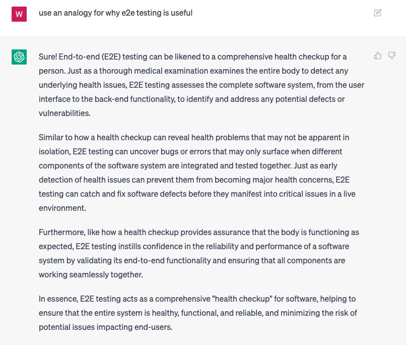
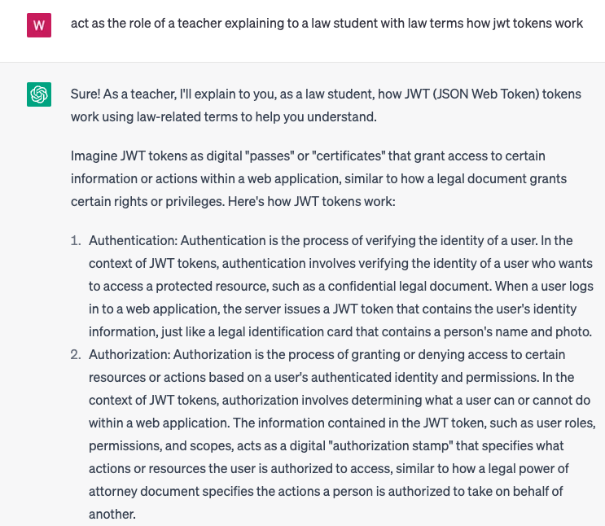
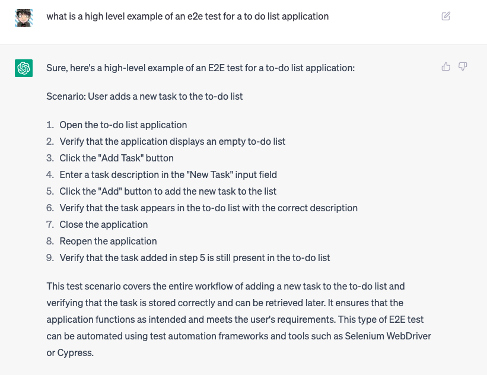

---
authors:
  - Wilfred Lan
tags:
  - ChatGPT
  - Learning
  - Software Development
  - Large Language Models
date: 2023-05-05T12:21:50.000Z
title: "Leverage Larning with ChatGPT"
---

## Leveraged Learning with Large Language Models by Wilfred Lan

In this blog post I’ll be diving into how we can combine cognitive science with our new flavour of the month AI interface ChatGPT in order to deepen our understanding as well as boost how fast we can learn new technologies and frameworks in the context of a programmer.

As I’m sure many others discovered on their first try, ChatGPT was a combination of intriguing, fascinating and also scary - because of how limitless the possibilities seemed. But as we have seen many times in history, with hype also comes fear, and now this sentiment has spread across the internet with concerns about programmers being at risk due to how powerful these AI tools are. So with a mixture of fear and curiosity I decided to dive deep and see just how capable ChatGPT is, and hopefully by embracing it I could see whether or not it's something that is actually useful or if it's all talk (or chat in this case!). Of course I am limited by the current existing technologies, and I’m sure many of the pitfalls mentioned will be fixed in upcoming iterations, but until then let's see how useful it can really be for learning, one of my favourite parts about being a Developer and a very vital skill to have too.

## Why Learning is critical for Software Development

Learning is a crucial part of being a Software Developer - technology has always been evolving and although there are certain stable methodologies that have stood the test of time, with 3 years of experience under my belt now I’m no stranger to the fact that there is still a lot of knowledge left to learn in my career. Furthermore since I generally specialise more towards frontend development, anyone that's familiar with it would know how fast the frameworks come and go. But now more than ever with the onset of AI looming, I believe learning is becoming even more important because if one doesn’t keep up to date with the potentially rapid changing pace of development, then certainly the risk in career could be a lot greater.

## Standard Learning Process

So let's start off with a typical situation of how the learning occurs the traditional way - without ChatGPT. I’m currently taking part in a structured learning initiative as part of Ippon called the Black Belt Program, that allows one to specialise in a chosen field and receive mentorship and guidance towards mastery of an area. As part of my current “Green belt” in the Full Stack frontend specialisation, I need to be able to explain several topics to my mentor - for example regarding JWT Token as well as E2E Testing.

If we apply principles from popular learning frameworks such as Blooms taxonomy, we can see how they also apply to learning new technology:

Back in University I minored in Psychology where I learnt more about the cognitive science behind learning. This is where I learnt about **Blooms Taxonomy, **a framework that promotes deeper understanding over the standard rote learning and memorization of facts, and also helped explain why cramming for exams by simply recalling facts would not lead to long term understanding or even be very applicable in an exam situation since it **lacked context.** So since then I’ve always tried to use this as a kind of guideline to assist me in making sure I am better aware of where I stand in the learning process for a new concept as well as how I should be looking to improve.

The idea here is for example that just “remembering” or “understanding” and being to explain a concept is different from being able to create or analyse a concept for a greater depth of understanding, but at the same time the lower levels are still prerequisites in order to reach the higher levels of mastery.

In the context of programming, even though it is often tempting and probably very popular to be copy pasting code directly from stackoverflow, we really should have a decent understanding of the concept at least from a high level about what we are actually working with - otherwise we can go down a route with unforeseen errors that could have otherwise been avoided.

Now the difficult part here is that we must manually find relevant resources in order to gain the initial understanding and remember phase - where Google is the goto. The first question I always have is based around **why. **Why is this piece of technology important, how does it fit with my pre-existing knowledge or beliefs and why is it important? Or maybe its not relevant at the time but I still need to know more about it. But with that we are left with a few problems - finding answers that are a combination of **consistent, reliable **and **relatable.** What I mean by that is, maybe we find the perfect Stackoverflow question that answers the exact question we had in mind - but as we all know Stackoverflow answers vary considerably in quality and we can’t always expect a high level answers that always makes sense to every single person, we need to go through multiple sources and compile a bunch of information in order to really get a good understanding here. Lastly, relatability is important because it allows us to fulfil parts of the “analyse” step in Blooms Taxonomy. The idea here is to leverage our existing knowledge in order to learn concepts more easily - one example is how we learn the “queue” data structure: because it follows the same concept as how a queue works like any line at a fast food restaurant, the concept of LIFO (last in, first out) becomes a lot easier to grasp than it would have been if we had to learn from complete scratch.

>>>>>  gd2md-html alert: inline image link here (to images/image2.png). Store image on your image server and adjust path/filename/extension if necessary.  (<a href="#">Back to top</a>)(<a href="#gdcalert3">Next alert</a>) >>>>> 

Ultimately although it is definitely possible to find information online that fits the three criteria, it is a tedious and time consuming process that can be demotivating at times with how fast we expect information to arrive these days. After we finally piece together all this information we can then finally begin the learning process itself, which may lead to further questions and research needing to be done.

A subset of the many questions that need answering.

## Learning Process - enhanced

So let's look at how ChatGPT can help us make our lives easier. Upon initially using ChatGPT briefly I, like many others, was very pleasantly surprised by how much it “knew” - it could piece together information and basically seemed to handle anything you throw at it - and that's precisely one area which raises concern - in its current form as of this writing, ChatGPT cannot verify if the information it provides is actually accurate or not, it only spits out what's in its model. In order to truly know what we can actually rely on and use it for, we need to understand a bit better about what's going on under the hood for ChatGPT.

ChatGPT is a LLM (large language model) - what better way to explain than to let it explain itself:

After getting a better understanding of how ChatGPT actually works, we can have a better idea of what kind of information we should be asking it - to put it simply, **information that already exists. **This is where ChatGPT shines the most, as its able to combine and bring a lot of new connections between pre-existing information in its model and feed it back to us in ways that may be otherwise not so obvious for us.

So how can we apply this to our own learning?

Because it can help our understanding of things by applying it to specific contexts that are understandable for whatever domain we are already familiar with - for example, making analogies:

Or, for someone who is completely unfamiliar with tech it can still do a great job explaining concepts by making specific terms **from a different field:**

>>>>>  gd2md-html alert: inline image link here (to images/image6.png). Store image on your image server and adjust path/filename/extension if necessary.  (<a href="#">Back to top</a>)(<a href="#gdcalert7">Next alert</a>) >>>>> 

These all seem well and good and actually provide a different way of thinking about the concept which can help build understanding and promote cross-domain knowledge - however it does come with one major flaw that it actually mentioned earlier in its response:

**It does not actually know if the information provided is valid or not.**

This is obviously an issue as it means that it narrows down the use case to fields where the user already does have some knowledge about the subject or needs to do the verification afterwards. From my testing and understanding, its generally safe for popular and well-known topics because it has lots of data to work with, but things can get a little funny when working with more niche or newer frameworks, where it can try and make up methods that don’t exist for example but be 100% convinced it does. This is the other issue, that it answers in a deceptively confident manner where you need to do your own due diligence and ensure the information it provides is correct.

One area is it helps scaffold the initial learning process by providing helpful summaries within a certain context that is most relevant to you. Rather than in the earlier example where we needed to find a context that makes sense manually by wading through Stack Overflow or YouTube, I can simply query directly “how to write E2E tests in javascript” or even “what are some recommended ways to write E2E tests in JS” and get some immediate leads whilst continuously engaging in a context relevant discussion:

^Prompting a high level understanding of the topic.^

^Asking for specific information to compare it to pre-existing information^

^Asking for a specific example - the “apply” in Bloom’s taxonomy^

^Asking for specific example with actual code output^

As you can see, with some simple prompts we can generate some specific information about the topic from a high level as well as ask contextual questions (if one is already familiar with integration tests) and then quickly dive deep into actual code examples generated with Cypress, and hopefully this can show how we can narrow the window between the different hierarchies of Blooms taxonomy, from understanding to application, in a much easier fashion compared to the old approach - now, again, we do need to be wary of the code it generates and perhaps that may be out role as Software Developers in the future as we want to make sure the code is actually safe and good to use. But at the very least it provides a good amount of both practical and theoretical information in a very accessible manner that can later be refined with more experience and discussion.

## Conclusion

Through this blog we have learnt how we can better use ChatGPT in order to enhance our learning experience - understanding a bit more the pros and cons of using it in its current state, where it can be helpful and what to watch out for. It seems clear that there are already genuine valid use cases for it to speed things up for us, and I’m excited to dive deeper and see how else it can be handy. Of course we must always be wary of the legitimacy of the information provided as it cannot evaluate this, and also that ultimately in this learning process we must still do the hard work of evaluating our own knowledge and understanding, as well as questioning what we need to know - because ultimately, ChatGPT is a tool for us to use rather than a replacement of Developers altogether.

I encourage you to try it out and see which areas it can help in your learning journey!
